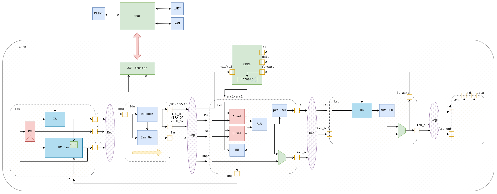

# NPC

NPC is the main part of Yprocessor, and the RTL design is achieved by Chisel. You can find the source codes in `playground/src` directory, and you can find the test files in `playground/test` directory.

## Architecture

NPC is a traditional 5-stage single issued pipeline processor, only support RV64IM instructions, I will add trap in the future. In addition to core combinational logic, NPC also implements the AXI bus, a 65-bit Wallace tree multiplier, and both 4KB two-way set-associative instruction cache and data cache.

The architecture is shown as follows.



## Run

To build the source files and generate SystemVerilog files, use:

```shell
make build
```

**You should install [mill](https://mill-build.com/mill/Installation_IDE_Support.html) and [firtool](https://github.com/llvm/circt) on your system!**

To test the implementations, run:

```shell 
make test
```

If you only want to test one module, likes ALU, you can run with:

```shell
make testonly TESTCASE=core.modules.AluTest
```

To reformat the source codes, run:

```shell
make reformat
```

The reformatting rules are in the `.scalafmt.conf` file.

To generate verilator archives for NSIM, run:

```shell
make verilator
```

To clean the build files in  work place, use `make clean`.

## Test

Based on above implementation and simulated by Verilator, I completed **cpu-test** and **alu-test** provided by [am-kernels](https://github.com/NJU-ProjectN/am-kernels), all the test cases worked normally. Besides, I completed **Dhrystone**, **CoreMark** and **Microbench** 3 benchmark test, the test results are as follows.

| Test Name  | Score | IPC  | Frequency(/MHz) |
| ---------- | ----- | ---- | --------------- |
| Dhrystone  | 4     | 0.45 | 0.99            |
| CoreMark   | 12    | 0.54 | 1.32            |
| Microbench | 12    | 0.48 | 1.18            |

